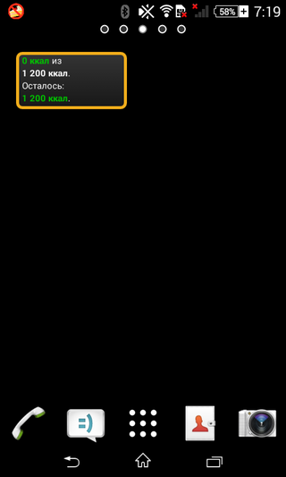

# Дневник калорий

Программа для учёта калорийности съеденной пищи.

## Особенности

* быстрое добавление информации &mdash; программа не содержит каталога продуктов, поэтому не придётся мучиться с неудобным поиском; калорийность же чаще всего написана на упаковке или легко находится в интернете;
* расчёт среднесуточного числа потребляемых калорий;
* построение графика потребляемых калорий;
* поддержка лимитов (мягкого и жёсткого) с уведомлением о превышении;
* виджет с данными по текущему дню;
* возможность экспорта истории в XML-файл с простой структурой;
* открытый исходный код (репозиторий: https://github.com/thewizardplusplus/diary-of-calories).

## Скриншоты

## Лицензия

The MIT License (MIT)

Copyright &copy; 2013, 2015, 2016 thewizardplusplus <thewizardplusplus@yandex.ru>
